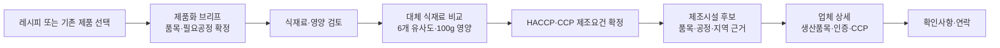

# 통합 서비스 블루프린트

## 1. 사용자 흐름

## 2. 서비스 축

| 축 | 주요 질문 | 실제 데이터 | 완료 조건 |
|---|---|---|---|
| 공개 탐색 | 어떤 제품을 누가 생산했나 | `production_log`·`facility` | 제품↔업체 양방향 이동 |
| 제품화 작업 | 이 레시피·대체안의 제조요건은 무엇인가 | 레시피·식재료·사용자 확인 | 품목·CCP·지역 브리프 확정 |
| 대체 식재료 | 어떤 후보가 왜 유사한가 | `substitute_pairs`·`standard_foods` | 현재 UI·정렬·근거 회귀 0 |
| 공동제조 매칭 | 어느 시설이 이 품목·공정에 가까운가 | `company_profiles`·`haccp_cert`·`facility` | 일치·미충족·미확인 근거 |
| 업체 검증 | 이 업체가 실제로 무엇을 생산하고 무엇을 인증받았나 | `production_log`·`haccp_cert`·`sales_suspension` | 품목·인증·CCP·상태 분리 표시 |
| 연락 | 무엇을 추가 확인해야 하나 | 앞 단계 미확인 조건 | 문의는 마지막 보조행동 |

## 3. 완료 게이트

어떤 기능도 `화면이 존재한다` 또는 `HTTP 200이다`로 완료 처리하지 않는다.

`legacy asset → approved source → published schema → API → UI → browser QA → user-value UAT`의 일곱 단계가 모두 연결되어야 완료다.

| 실패 예 | 판정 |
|---|---|
| 시설 목록에 HACCP 불린만 표시 | HACCP 상세·공정 매칭 미완료 |
| 문의문안이 있지만 후보 근거가 없음 | 공동제조 기능 미완료 |
| 제품 코드가 남아 있지만 실제 DB에 테이블이 없음 | 기능 미존재 |
| 과거 F1 모델 파일만 존재 | 런타임 매칭 미구현 |
| 테스트가 문구·요소 존재만 확인 | 사용자 가치 미검증 |
